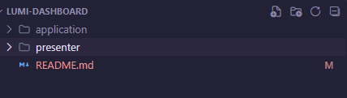

## LUMI DASHBOARD

Olá, sejam bem vindos a conclusão do teste prático da Labs-Lumi.

## Apresentação

  - Este projeto contempla duas pastas principais que são responsáveis pelo font-end(Presenter) e back-end(application)

  - Para iniciar o projeto e necessário ter o NodeJs na versão LTS e o Docker instalado em sua máquina.

  ### Inicio
  - Realize o download do repo no github:

  ```shell
  gh repo clone Gustavo-Murdiga88/lumi-dashboard
  
  ## or

  git@github.com:Gustavo-Murdiga88/lumi-dashboard.git
  ```

  ## Baixar as dependências
  - Após o download do repo e estar localizado em sua pasta principal, você terá uma estrutura parecida como esta.
  
    
  
  - Em seguida devemos entrar em cada uma das pastas principais e realizar a instalação das dependências

    ````shell
    cd /presenter

    pnpm install

    ## and

    cd /application

    pnpm install

    ````
  <br/>

  ## Executar as migrations do prisma (BACK-END)
  - Depois do processo a cima, será necessário executar as migrations do banco de dados e para isso, precisamos executar nosso container do docker. Este projeto contempla uma configuração já realizada em um arquivo 'docker-compose.yml' na raiz do mesmo.

  - Para que possamos executar container basta irmos até a pasta /application do projeto e executar:
 
    ```shell
      cd /application

      docker compose up -d
    ```

  - Após este processo, devemos realizar o comando que executa as nossas migrations do prisma.
 
    ```shell

    pnpm prisma migrate deploy

    ```

  ## Iniciar o back-end
  
  - Enfim podemos executar nosso servidor, este projeto conta duas principais maneiras para ser executado, em modo desenvolvedor, com o tsx (lib para realizar um fast-reload e a compilação de código typescript) ou, em modo de produção bastando apenas rodar o comando (pnpm build): 
  
  ```shell
  ## mode production
  pnpm run build

  node /dist/entry.js

  ## or
  
  ## development mode
  pnpm run dev

  ```

  - Posteriormente este processo seu servidor estará disponível e você receberá uma mensagem em seu terminal que se parece com esta:
    
  


## Iniciar o front-End
  - Este projeto foi construído com a base do NextJS, na versão 14, então aconselhamos que seja utilizado na versão dev, porém não haverá problemas se realizado o build e então ser executada a versão de build em localhost, fique a vontade para realizar o processo que mais se sentir confortável.

  - Para iniciarmos basta então irmos até a pasta /presenter e realizar o seguinte comando

  ```shell
  ## init next server
  pnpm run dev

  ```
  - Em seguida este processo você receberá uma mensagem em seu terminal indicando em qual endereço o projeto esta sendo executado. Ex:

  


  ## Layout

  - O Layout utilizado para o teste prático foi referenciado a partir de alguns layouts que criei para um projeto pessoal, e este pode ser encontrado neste projeto do <a href="https://www.figma.com/file/byZlLPzz30re75KJfCRM9v/Or%C3%A7amenteiro?type=design&node-id=0%3A1&mode=design&t=m5tFyIMaBqPErfpr-1" target="_blank">figma</a>


  ## Pages
  - dashboard

    

  - biblioteca de faturas

    

    

  ## Testes 
  - Para executar os teste de unidade e testes de integração sigas os passos a seguir.
  
  - Testes de unidade
    ```shell
    cd /application

    pnpm run test

    ## or

    pnpm run test:watch

    ```
  - Teste e2e 
    
    - Para realizar estes testes se é necessário ter o nosso container do docker online então para que seja possível realizar estes testes execute:

    ```shell 
    docker compose up -d 

    pnpm run test:e2e

    ## or

    pnpm run test:e2e:watch

    ``` 